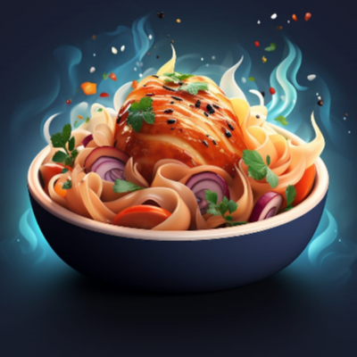

# What Should I Cook?

 

A cooking suggestion app that uses the power of AI. By  uploading an image of your available ingredients, get back a list of recipes you can cook!

## Features:

- **Ingredient Detection**: Upload an image, and the ingredient detection tool, built using Roboflow in conjunction with YOLO, will identify the ingredients for you.
- **Personalized Recipe Suggestions**: Based on detected ingredients, dietary preferences, and intolerances, receive personalized recipe suggestions.
- **Easy to Use**: Intuitive user interface built with React.

## Tech Stack:

- **Frontend**: React, Ionic.
- **Backend**: Flask (Python) hosted on an AWS EC2 instance.
- **AI**: Custom Image Processor for ingredient detection, used in combination with YOLO.
- **API**: Spoonacular API for fetching recipes.

## Getting Started:

Prerequisites:
Ensure you have Node.js and Ionic installed on your system.
Installation:
1. Clone the repository:
git clone https://github.com/Ilai-Av-Ron/what-should-i-cook.git
2. Navigate to the project directory:
cd what-should-i-cook
3. Start the Ionic app:
ionic serve
4. Visit the application: Open your browser and head to http://localhost:8100 (or the port mentioned in your terminal when ionic serve is executed).

Contributing:
Pull requests are welcome. 

License:
MIT

Acknowledgements:
- My mentor for this project, David Kalmanson.
- Spoonacular API for providing extensive recipe details.
